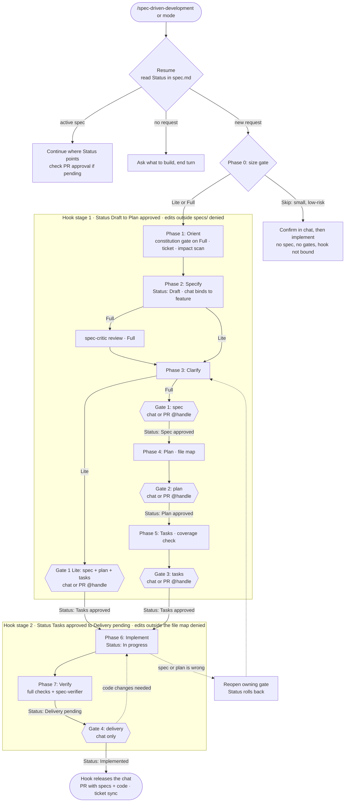
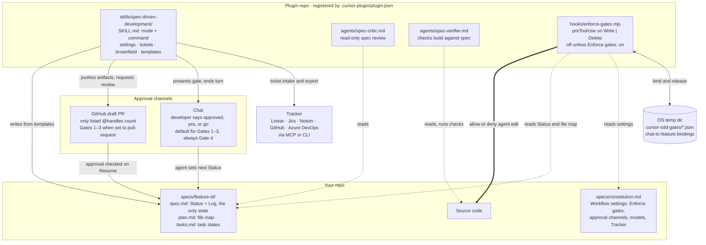

# Spec-Driven Development for Cursor

A Cursor mode that turns a feature request into an approved spec, plan, and task list before any code is written, then checks the finished work against that spec.

The spec lives in your repo next to the code, so it carries over between sessions, teammates, and reviews.

## How it works



The hook stages apply only with `Enforce gates: on` (see [Settings](#settings)).

The agent picks a track based on the size of the change, and you can override it:

| Track | For | Approvals |
|-------|-----|-----------|
| Skip | Small, low-risk changes | A quick confirm, no spec |
| Lite | 1-3 files in one area | Spec, plan, and tasks together, then delivery |
| Full | 4+ files, API or schema changes, security-sensitive work | Spec, plan, tasks, and delivery separately |

Before asking you anything, the agent checks the code for answers, so its questions are the product decisions only you can make. On larger changes, a separate reviewer agent checks the spec for gaps before you approve it. On every change with a spec, a verifier agent checks the finished code against each requirement.

## Install

macOS and Linux:

```bash
git clone https://github.com/joshjonesDEMO/Cursor_SpecDrivenDevelopment ~/.cursor/plugins/local/spec-driven-development
```

Windows (PowerShell):

```powershell
git clone https://github.com/joshjonesDEMO/Cursor_SpecDrivenDevelopment "$env:USERPROFILE\.cursor\plugins\local\spec-driven-development"
```

Restart Cursor. **Spec-Driven Development** is then available as a custom mode and as a command. Teams can also add this repo to their plugin marketplace.

## Use

Switch to the custom mode, or start with the command:

```text
/spec-driven-development Add account lockout after repeated failed logins. ENG-1234
```

You can also run `/spec-driven-development` on its own. If nothing is already in progress, the agent asks what to build before it starts. Include a ticket link or key when you have one.

Approvals are saved in the spec, so running the command again in a new chat picks up where you left off.

## What gets written

```text
specs/
  constitution.md              # project principles and workflow settings
  ENG-1234-account-lockout/
    spec.md                    # what and why, plus the feature's status
    plan.md                    # how
    tasks.md                   # the steps, each with its own check
```

For existing code with no spec, the agent can first write down what the code does today, so the change can list what it adds, changes, and must keep working.

## Settings

Each repo can adjust the workflow in `specs/constitution.md`. These are the defaults:

```markdown
- Enforce gates: off
- Spec approval: chat
- Plan approval: chat
- Tasks approval: chat
- Critic model: ask
- Verifier model: ask
- Tracker: auto
```

- **Enforce gates: on** adds a hook that blocks the agent's file edits before the tasks are approved, and edits outside the approved plan after that. It's a safety net for a skipped step. It doesn't cover shell commands, or the subagents that build parallel tasks, and reviewing the spec's log is still the real check. It needs Node 18 or newer.
- **pull-request @handle** on an approval setting sends that approval to a GitHub reviewer, such as a product manager or architect, on a draft PR.
- **ask** on a model setting means the agent asks which model to use for the reviewer and verifier.
- **Tracker** sets the ticket system, or `auto` detects it from the ticket link.

Full details: [settings.md](skills/spec-driven-development/settings.md).

## Ticket integrations

Share a ticket link or key and the agent drafts the spec from it. After approval, it can also create tasks back in your tracker and link the PR.

There are built-in instructions for **Linear**, **Jira Cloud**, **Notion**, **GitHub Issues**, and **Azure DevOps**. They work once that tracker's MCP server is connected in Cursor. Jira, GitHub, and Azure DevOps also work through their CLIs. Other trackers (including self-hosted Jira) work through their MCP server, CLI, or API, and pasted ticket text works anywhere.

If the tracker isn't connected yet, the agent offers to install its Cursor plugin and sign you in, then carries on. Azure DevOps has no Cursor plugin, so the agent explains the manual setup instead. Details: [tickets.md](skills/spec-driven-development/tickets.md).

## What's included

| Component | Purpose |
|-----------|---------|
| `skills/spec-driven-development/` | The mode, templates, and guides for settings, tickets, and existing code |
| `agents/spec-critic.md` | Reviews a draft spec for gaps |
| `agents/spec-verifier.md` | Checks the build against the spec |
| `hooks/` | Optional gate enforcement, off by default |

How the pieces connect, where state lives, and how approvals flow:



Run the hook's tests with `npm test`.

## License

MIT
